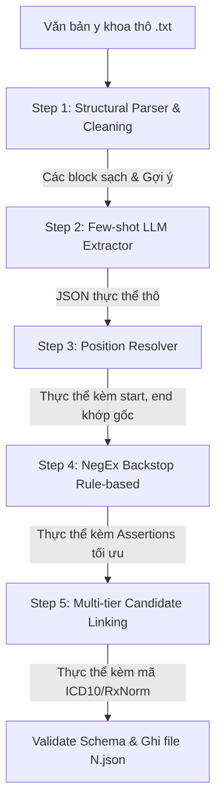

# Thiết kế hệ thống: TVT/NER Y khoa tiếng Việt — Structure-Aware Few-Shot Extraction

Tài liệu thiết kế chi tiết cho giải pháp trích xuất thực thể y tế (NER), suy luận ngữ cảnh (Assertions) và chuẩn hóa danh mục (Candidate Linking) tiếng Việt dưới điều kiện hạn chế tài nguyên và không có sẵn dữ liệu huấn luyện.

---

## 1. Ngữ cảnh & Ràng buộc kỹ thuật

### 1.1. Ràng buộc phần cứng & Môi trường chạy
- **Local**: Windows, GPU RTX 3050Ti (4GB VRAM). Dùng để viết mã nguồn, debug nhanh và chạy thử nghiệm.
- **Production**: Google Colab / Kaggle Notebook (GPU T4 15GB VRAM). Dùng để chạy suy luận (inference) trên toàn bộ 100 file.
- **Môi trường LLM**: Sử dụng `llama-cpp-python` để chạy mô hình định dạng GGUF (Khuyên dùng: `Qwen2.5-7B-Instruct-Q4_K_M.gguf`).
- **Ràng buộc cuộc thi**: Không sử dụng các API ngoài (OpenAI, Claude, v.v.), tất cả thư viện và dữ liệu tra cứu phải chạy offline.

### 1.2. Thang điểm đánh giá (Metric)
- Điểm tổng hợp: $0.3 \cdot Text\_Score (WER) + 0.3 \cdot Assertions\_Score (Jaccard) + 0.4 \cdot Candidates\_Score (Weighted\ Jaccard)$
- Luật phạt kép: Đúng thực thể nhưng sai nhãn `type` bị phạt gấp đôi (tương đương thừa 1 thực thể sai và thiếu 1 thực thể đúng).

---

## 2. Kiến trúc hệ thống & Luồng xử lý (Data Flow)

Hệ thống được thiết kế theo dạng Pipeline tuần tự gồm 5 bước độc lập:



---

## 3. Thiết kế chi tiết các Module thành phần

### 3.1. Step 1 — Structural Parser & Normalization (`src/parser.py`)
- **Phân mảnh văn bản**: Sử dụng Regex để quét và phân chia văn bản thành các block dựa theo các tiêu đề phân mục (đầu mục số như `1.`, `2.`, `3.` hoặc các đề mục con kết thúc bằng dấu hai chấm).
- **Từ điển Regex Header thực tế**:
  - `HISTORY` (Tiền sử): Tiền sử bệnh, tiền sử bệnh nội khoa, tiền sử bệnh lý, tiền sử bệnh lý mạn tính.
  - `MEDICATIONS` (Thuốc đang dùng): Thuốc trước khi nhập viện, thuốc đang dùng trước khi nhập viện.
  - `CURRENT_HISTORY` (Bệnh sử hiện tại): Bệnh sử hiện tại, tiền sử bệnh hiện tại, lịch sử bệnh hiện tại.
  - `SYMPTOMS` (Triệu chứng hiện tại): Triệu chứng hiện tại, triệu chứng khi nhập viện.
  - `LABS` (Xét nghiệm & Hình ảnh): Kết quả xét nghiệm, cận lâm sàng, kết quả chẩn đoán hình ảnh.
  - `HOSPITAL_EVALUATION` (Đánh giá viện): Đánh giá tại bệnh viện, khám tại bệnh viện, tình trạng lúc vào viện.
- **Tiền xử lý dính chữ**:
  - Phát hiện lỗi dính chữ do lỗi định dạng/OCR (Ví dụ: `tạiBệnh` -> `tại Bệnh`, `uống2chai` -> `uống 2 chai`).
  - Sử dụng từ điển âm tiết tiếng Việt để chèn khoảng trắng hợp lý.
  - *Lưu ý quan trọng*: Việc làm sạch này chỉ tạo ra bản sao để gửi cho LLM. Văn bản gốc được giữ nguyên để tính toán vị trí ký tự ở Bước 3.

### 3.2. Step 2 — Few-shot LLM Extraction (`src/extractor.py`)
- **Inference Engine**: `llama-cpp-python` load model `Qwen2.5-7B-Instruct-Q4_K_M.gguf`.
- **Ràng buộc đầu ra (Constrained Decoding)**: Sử dụng **GBNF Grammar** để ép LLM xuất ra đúng định dạng JSON Schema của thực thể.
- **JSON Schema cấu trúc**:
  ```json
  {
    "text": "chuỗi thực thể",
    "type": "TRIỆU_CHỨNG | TÊN_XÉT_NGHIỆM | KẾT_QUẢ_XÉT_NGHIỆM | CHẨN_ĐOÁN | THUỐC",
    "assertions": ["isNegated" | "isFamily" | "isHistorical"],
    "med_brand": "tên biệt dược",
    "med_ingredient": "hoạt chất",
    "med_strength": "hàm lượng",
    "med_form": "dạng bào chế"
  }
  ```
- **Few-shot Prompting**:
  - Tiêm gợi ý nhãn mặc định từ Bước 1 vào ngữ cảnh.
  - Cung cấp ít nhất 2 ví dụ few-shot chi tiết, bao gồm các ca khó (phân biệt Triệu chứng vs Chẩn đoán).
  - Yêu cầu LLM trích xuất nguyên văn (verbatim), giữ nguyên lỗi chính tả.

### 3.3. Step 3 — Position Resolver (`src/resolver.py`)
- **Công cụ**: Sử dụng **`rapidfuzz`** thực hiện so khớp chuỗi mờ (Fuzzy string matching).
- **Chi phí Edit Distance tùy chỉnh**:
  - Đặt chi phí thay đổi/chèn/xóa khoảng trắng là `0.1` (rất thấp) so với chi phí thay đổi ký tự là `1.0` (cao).
  - Thuật toán sẽ tìm vị trí tối ưu trong văn bản gốc mà chuỗi trích xuất từ LLM trỏ tới (dung thứ lỗi thiếu dấu cách do dính chữ).
- **Quy tắc**: Lấy vị trí ký tự gốc `[start, end]` và cập nhật lại trường `text` của thực thể theo đúng nguyên bản trong văn bản gốc.

### 3.4. Step 4 — NegEx Backstop (`src/verifier.py`)
- **Công cụ**: Bộ luật Regex tiếng Việt thuần túy.
- **Nguyên lý**: 
  - Quét ngữ cảnh lân cận thực thể để tìm các trigger phủ định (`không`, `chưa phát hiện`, `âm tính`, `loại trừ`) hoặc tiền sử.
  - Nếu phát hiện trigger phủ định mạnh nhưng LLM bỏ sót nhãn `"isNegated"`, thực hiện ghi đè kết quả của luật lên thực thể.

### 3.5. Step 5 — Candidate Linking (`src/linker.py`)
- **Tầng 0**: Giải nghĩa viết tắt qua từ điển `abbr_dict.json` tự xây dựng.
- **Tầng 1**: Khớp trực tiếp (exact match) từ điển ICD-10 tiếng Việt hoặc danh mục thuốc Bộ Y Tế.
- **Tầng 2 (ICD-10)**: Hybrid Retrieval:
  - Lexical Search: Dùng `rank_bm25`.
  - Semantic Search: Sử dụng model `SapBERT-UMLS-2020AB-all-lang-from-XLMR` kết hợp với `numpy` tính cosine similarity.
  - RRF Fusion: Hợp nhất xếp hạng từ BM25 và SapBERT để chọn ra mã ICD-10 tối ưu nhất.
- **Tầng 2' (RxNorm)**:
  - Sử dụng các trường cấu trúc `med_*` truy vấn trực tiếp CSDL SQLite RxNorm offline (`rxnorm.db`) để ánh xạ sang mã RxNorm chuẩn.
- **Tầng 3**: Fuzzy matching cuối cùng bằng `rapidfuzz` để bắt lỗi chính tả nhẹ còn sót.

---

## 4. Quy trình kiểm định & Đóng gói an toàn

### 4.1. Bộ tự kiểm định (`src/evaluator.py`)
- **Dữ liệu**: Gán nhãn thủ công cho 7 file mẫu (4, 14, 18, 70, 88, 93, 99.txt) thành định dạng JSON ground truth đặt tại `data/ground_truth_7/`.
- **Chức năng**: Chạy pipeline trên 7 file này, so sánh kết quả và tính toán chính xác điểm WER (`text`), Jaccard (`assertions`), Weighted Jaccard (`candidates`) và điểm tổng hợp để kiểm soát chất lượng sau mỗi lần tinh chỉnh.

### 4.2. Đóng gói (`main.py`)
- **JSON Validation**: Dùng thư viện `jsonschema` quét toàn bộ 100 file JSON đầu ra trước khi nén để đảm bảo không chứa giá trị `null`, không sai nhãn nhầm kiểu, và `position` hợp lệ.
- **Nén file**: Đóng gói thư mục `output/` chứa chính xác 100 file thành `output.zip` bằng thư viện `zipfile` của Python.

---

## 5. Kế hoạch xác thực (Verification Plan)

### 5.1. Xác thực tự động
- Chạy script `src/evaluator.py` để đảm bảo hệ thống đạt điểm tối ưu trên tập 7 file mẫu.
- Chạy script kiểm tra định dạng Schema trên toàn bộ 100 file.

### 5.2. Xác thực thủ công
- Mở ngẫu nhiên 5 file JSON trong thư mục `output/` sau khi pipeline hoàn thành để so sánh trực quan vị trí ký tự trích xuất có khớp chính xác với văn bản gốc hay không.
